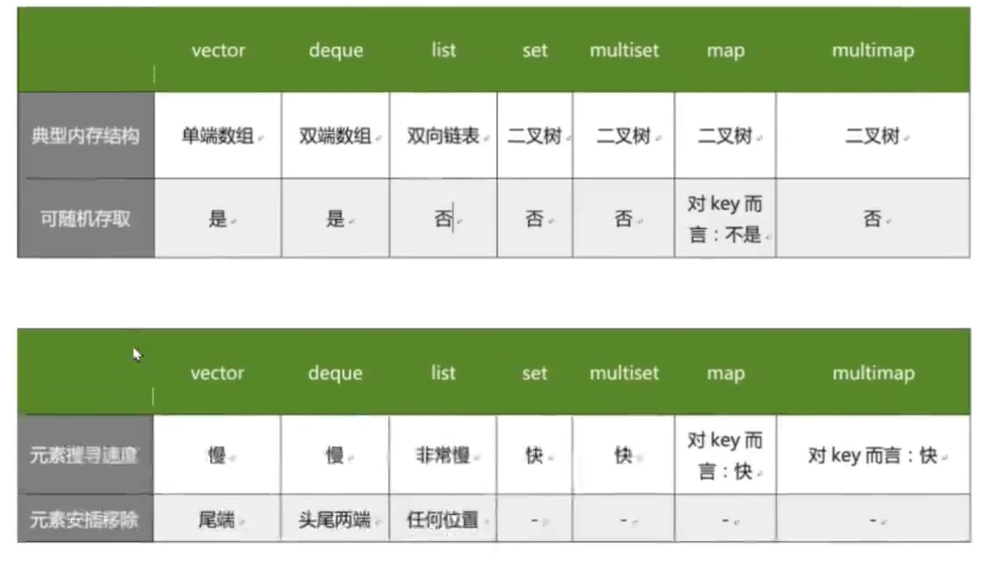

# STL容器使用时机

## 何时使用STL容器

### vector的使用场景

    比如软件历史操作记录，我们经常要查看历史记录，比如上一次的记录，上上次的纪录，但却不会去删除记录，那么我们就可以用vector来保存历史记录，然后根据需要查看历史记录。

### deque的使用场景

    比如排队购票系统，对排队者的存储可以使用deque，支持头端的快速移除，尾端的快速插入，并且支持随机访问。
    如果采用vector，则头端移除时，会移动大量的数据，速度慢。
    vector和deque的比较：
        一、vector.at()比deque.at()效率高，比如vector.at(0)是固定的，deque的开始位置却是不固定的。
        二、如果有大量释放操作的话，vector的效率会高于deque，这跟二者的内部实现有关。
    deque支持头部的快速插入和移除，这是deque的优点。

### list的使用场景

    比如公交车乘客的存储，随时可能有乘客下车，需要把乘客从队列中移除，list支持快速插入和移除，并且支持随机访问。

### set的使用场景

    比如手机游戏的个人得分记录的存储，存储要求从高到低的顺序排列，并且需要快速查找某个分数，set支持快速查找，并且支持快速插入和移除。

### map的使用场景

    比如按ID号存储十万个用户，想要快速通过ID查找用户，map支持快速查找，并且支持快速插入和移除。
    二叉树的查找效率这时就体现出来了。如果是vector容器，最坏的情况下可能需要遍历完整个容器才能找到目标元素，而二叉树查找只要一次查找就能找到目标元素。
